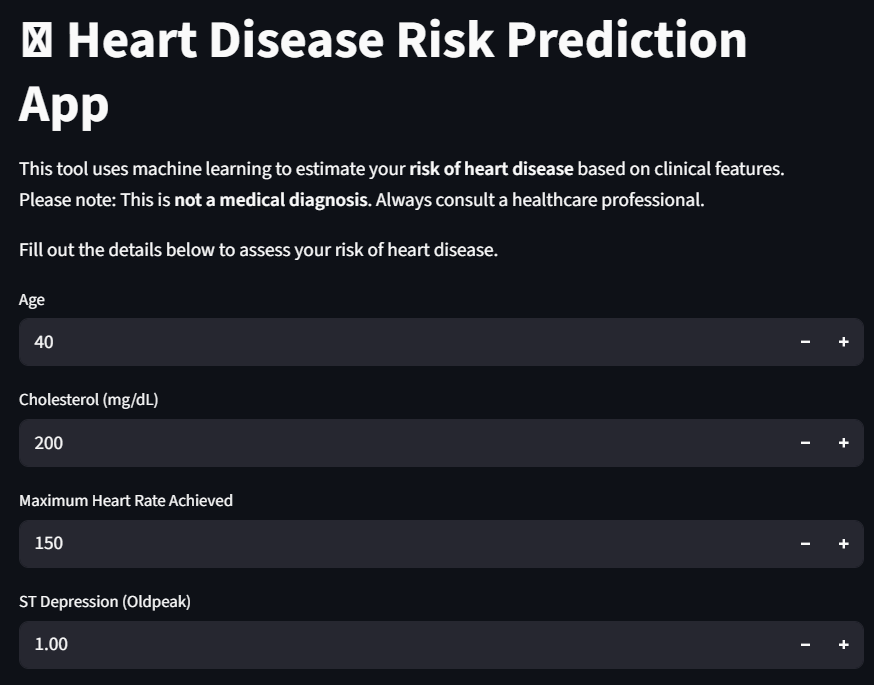
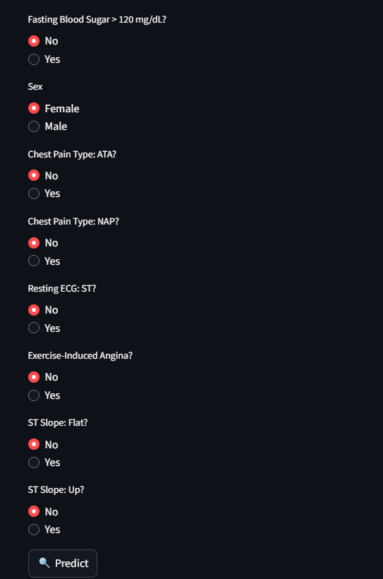
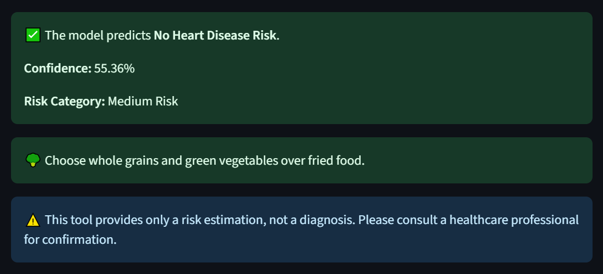

# 🫀 Heart Disease Risk Prediction App


A **Heart Disease Risk Prediction** web application built using Python and Streamlit.  
Predicts the likelihood of heart disease based on user clinical features using a trained machine learning model.

---

## 🔹 Features

- Interactive Streamlit web app for risk prediction  
- Exploratory Data Analysis (EDA) on raw heart datasets  
- Data Preprocessing & Feature Engineering  
- Machine Learning model using scikit-learn  
- Visualizations using Matplotlib and Seaborn  
- Supports multiple input features for accurate prediction  

---

## 📁 Project Structure

```
.
├── data
│   ├── raw                # Original CSV datasets
│   └── processed          # Cleaned CSV and saved model (.pkl)
├── notebooks
│   ├── 01_EDA.ipynb
│   ├── 02_preprocessing.ipynb
│   └── 03_Model.ipynb
├── src
│   └── app.py             # Streamlit App
├── .gitignore
├── requirements.txt
└── README.md
```

---

## ⚡ Installation

1. Clone the repository:

```bash
git clone https://github.com/AafaqueAnjum06/Predictive-Health-Model.git
cd heart-disease-app
```

2. Create and activate a virtual environment:

```bash
# Windows
python -m venv env
env\Scripts\activate

# Mac/Linux
python -m venv env
source env/bin/activate
```

3. Install required dependencies:

```bash
pip install -r requirements.txt
```

---

## 🚀 Usage

1. Ensure `heart_model.pkl` is present in `data/processed/`.  
2. Run the Streamlit app:

```bash
streamlit run src/app.py
```

3. Open the URL displayed in your browser.  
4. Enter clinical features to get your **heart disease risk prediction**.

---

## 📊 Demo




*Interactive Streamlit app predicting heart disease risk.*

---

## 📝 Input Features

| Feature Name       | Type        | Description                           |
|-------------------|------------|---------------------------------------|
| Age               | Integer     | Age of the patient                     |
| Sex               | Categorical | Male/Female                            |
| ChestPainType     | Categorical | Type of chest pain                     |
| RestingBP         | Integer     | Resting blood pressure                 |
| Cholesterol       | Integer     | Serum cholesterol level                |
| FastingBS         | Binary      | Fasting blood sugar (1 = true, 0 = false) |
| RestingECG        | Categorical | Resting ECG results                    |
| MaxHR             | Integer     | Maximum heart rate achieved            |
| ExerciseAngina    | Binary      | Exercise-induced angina (1 = yes, 0 = no) |
| Oldpeak           | Float       | ST depression induced by exercise      |
| ST_Slope          | Categorical | Slope of the peak exercise ST segment |

---

## 🛠️ Technologies Used

- Python
- Streamlit for web interface  
- Pandas & NumPy for data manipulation  
- scikit-learn for ML modeling  
- joblib for model persistence  
- Matplotlib & Seaborn for visualization  

---

## 💻 Output Example

| Feature Set Example | Predicted Risk (%) |
|--------------------|-----------------|
| Age: 55, Sex: M, ChestPainType: ATA, RestingBP: 140, Cholesterol: 250, FastingBS: 0, RestingECG: Normal, MaxHR: 150, ExerciseAngina: 0, Oldpeak: 1.5, ST_Slope: Up | 72% |

---

## ✍️ Author

**Aafaque Anjum**  
- GitHub: [https://github.com/AafaqueAnjum06](https://github.com/AafaqueAnjum06)  
- LinkedIn: [www.linkedin.com/in/aafaqueanjum06](www.linkedin.com/in/aafaqueanjum06)  


